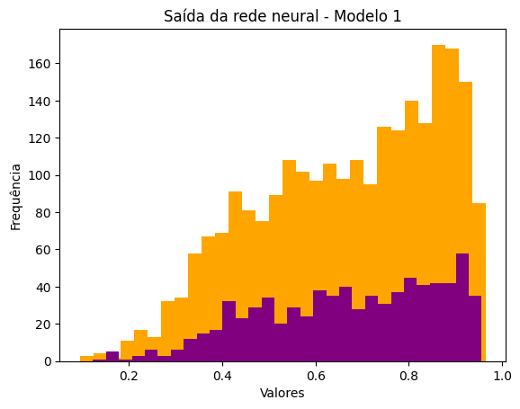

## Descrição do problema

O conjunto de dados está relacionado com variantes tintas e brancas do vinho português "Vinho Verde - referência [Cortez et al., 2009]. Devido a questões de privacidade e logística, apenas estão disponíveis variáveis físico-químicas (entradas) e sensoriais (saída) (por exemplo, não existem dados sobre tipos de uva, marca do vinho, preço de venda do vinho, etc.). Além disso, as classes são ordenadas e não equilibradas (ex. há muito mais vinhos normais do que excelentes ou ruins).

## Modelagem

Vamos usar redes neurais para classificar esses vinhos como bons ou ruins. Neste modelo serão usadas **```2 camadas```**: **```1 de entrada```** e **```1 de saída```**, com **```11 neurônios na camada de entrada```** e **```1 na camada de saída```**. Como só temos 1 classe binária então vamos usar 1 neurônio por classe, já que o valor produzido por esse neurônio será interpretado como a probabilidade do vinho pertencer à classe positiva. Isso justifica o fato de não utilizarmos neurônios nas camadas intermediárias.

O algoritmo implementado para treinamento será o **```backpropagation```**.

## ```Funções de ativação```

- camada de entrada: **```ReLu```**;
- camada oculta: não será implementada, apesar da função generalizar para camadas ocultas, caso queira adicionar posteriormente;
- camada de saída: **```Sigmóide```**.

A escolha pela **```ReLu```** na camada de entrada é porque como os neurônios somente são ativados com inputs positivos, então isso impede que todos os neurônios sejam ativados ao mesmo tempo. Um outro ponto importante é que ela torna o treinamento computacionalmente mais eficiente, permitindo um treinamento mais focado, isto é, com neurônios mais especializados.

Na camada de saída a escolha pela **```Sigmóide```** se deve ao fato dela transformar a saída da última camada em um valor no intervalo entre 0 e 1, representando uma probabilidade. Como este é um problema de classificação binária, esse valor pode ser interpretado como a probabilidade de pertencer à classe positiva, como dito anteriormente. Além disso a sigmóide é uma função de classe $C^\infty$, ou seja, todas as suas derivadas são contínuas, o que facilita o cálculo dos gradientes durante o treinamento quando se usa, por exemplo, o **```backpropagation```**. Ela também ajuda a evitar o problema de "explodir" gradientes, que pode ocorrer durante o treinamento de redes neurais mais profundas, pois limita a saída entre 0 e 1, evitando esses valores extremamente grandes.

## ```Função de otimização```

Embora o algoritmo **```Adam```** possua convergência mais rápida, a escolha é pelo **```SGD```** devido ao fato dele generalizar melhor que o primeiro e assim apresentar melhores resultados.

### ```Métrica utilizada```: ```F-Beta-Score```

Estamos lidando com um problema de classificação binária, do tipo: 
- 1 para vinhos bons; 
- 0 para vinhos ruins. 
  
Então, deve ser dada uma ênfase maior para os erros por falso positivo (vinho ruim classificado como bom) e falso negativo (vinho bom classificado como ruim), respectivamente essas métricas são a **```precision```** e a **```recall```**. Sendo assim, seria mais interessante usar a média harmônica entre elas que é definida pela **```f-beta score```**, ou seja, um valor alto de **```f-beta score```** só ocorrerá se a **```recall```** e **```precision```** forem altas. Além disso, a **```f-beta score```** também é uma boa métrica para trabalhar com classes desbalanceadas, que é o caso deste problema, onde temos aproximadamente **```66,51%```** de vinhos classificados como bons e **```33,49%```** classificados como ruins.

# Resultados


```python

  Modelo escolhido: 11 neurônios na camada de entrada e 1 na camada de saída

      TP: 53,7%
      TN: 22,7%
      FP: 10,8%
      FN: 12,8%  
```

```python

  Métrica para a matriz de confusão: F-Beta Score

      0: 0.64
      1: 0.83
  Lembrando que 0 só diz respeito à taxa de TN e 1 à taxa de TP.
```




## Considerações finais

Um ponto que deve ser relatado para a apresentação dos resultados é que há um desbalanceamento de classes em relação à quantidade de vinhos bons e ruins no dataset (temos mais vinhos bons do que vinhos ruins) e por isso foi utilizado a métrica **```f-beta score```** que para tratar melhor este desbalanceamento.

A partir da análise da matriz de confusão podemos inferir que o modelo apresenta bons resultados, com uma taxa total de acerto de **```76,4% (TP+TN)```** e de erro **```23,6% (FP+FN)```**. 

Uma outra observação é que aumentar a quantidade de neurônios não vai produzir melhora nos resultados, pois com **```22```** e **```33 neurônios```** os resultados mantiveram-se foram ligeiramente inferiores a **```11 neurônios```**. 

 No caso dos histogramas, podemos dizer que os dados de treino e teste possuem amplitudes semelhantes, indicando que o modelo não está se adaptando demais aos dados de treino. Isso é um bom sinal quando se leva em conta a capacidade de generalização do modelo para novos conjuntos de dados.

 ## Apêndice

#### Aspectos matemáticos sobre a função **```ReLu```**. 

Primeiramente, definimos ReLU por $$f(x) = \max(0, x).$$


Além das vantagens da ReLU como simplicidade, eficiência computacional e o aprendizado de padrões complexos nos dados devido à sua não linearidade, tem um aspecto que não é muito discutido - o fato da função ReLU ser uma **```função Lipschitz```**. Mas o que isso pode agregar nas Redes Neurais? Antes precisamos definir uma função Lipschitz.

Sejam $M, N$ espaços métricos e uma função $f: M \rightarrow N$, dizemos que $f$ é Lipschitz se existir um $L > 0$, chamada constante de Lipschitz, tal que 
```math 
$$d(f(x), f(y)) \leq Ld(x, y),$$ quaisquer que sejam $x, y \in M$
```
Lembrando que: 

⇨ Métrica é uma função $d : M \times M \rightarrow \mathbb{R}$ que associa a cada par ordenado $(x,y) \in M \times M$, um número real $d(x,y)$, chamado distância de $x$ a $y$. 

⇨ Um espaço métrico é um par ordenado $(M,d)$, em que $M$ é um conjunto não vazio e $d$ é uma métrica em $M$. 

Vale ressaltar que:

1) A constante de Lipschitz para a função ReLU é $L=1$.
2) Uma função ser Lipschitz é um critério mais forte do que ser contínua, pois toda função Lipschitz é contínua, mas o contrário não é verdade. 

**```Vantagens da utilização em Redes Neurais```**

⇨ Estabilidade numérica durante o treinamento de redes neurais, ou seja, pequenas variações nos valores das entradas não resultarão em grandes variações nos valores das saídas. Em outras palavras, como ReLU é uma função Lipschitz, então mesmo que haja pequenas variações nos valores de $x$, o aumento resultante em $d(f(x), f(y))$ é limitado pela constante $L=1$, garantindo assim que as variações permaneçam controladas.

⇨ Convergência mais rápida do algoritmo de otimização. Por exemplo, no caso do gradiente descendente, mudanças nos parâmetros do modelo não causarão mudanças drásticas na função de custo devido a ela ser limitada por $L=1$, isso além de diminuir o número de iterações permite atualizações mais eficientes e tamanhos de passo maiores no algoritmo de otimização.