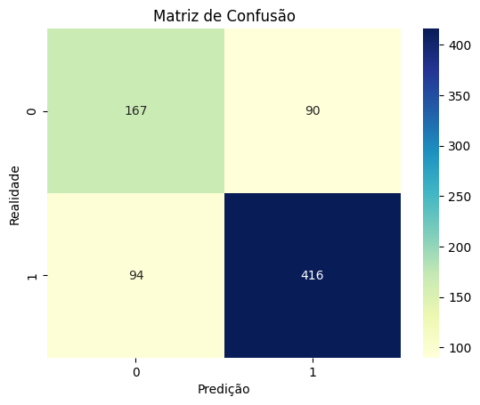
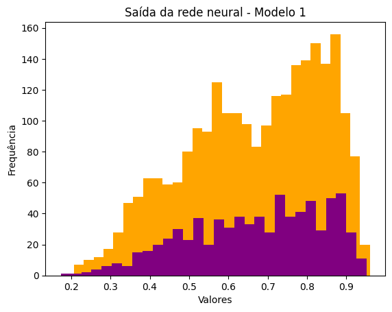

# Resultados



```python

  Modelo escolhido: 11 neurônios na camada de entrada e 1 na camada de saída

      TP: 54,2%
      TN: 21,8%
      FP: 11,7%
      FN: 12,3%  
```

```python

  Métrica: F1-Score

      0: 0.64
      1: 0.82
  Lembrando que 0 só diz respeito à taxa de TN e 1 à taxa de TP.
```




## Considerações finais

Um ponto que deve ser relatado para a apresentação dos resultados é que há um desbalanceamento de classes em relação à quantidade de vinhos bons e ruins no dataset (temos mais vinhos bons do que vinhos ruins).

A partir da análise da matriz de confusão podemos inferir que o modelo apresenta bons resultados, com uma taxa total de acerto de 75,9% (TP+TN) e 24,1% de erro (FP+FN). 

Uma outra observação é que aumentar a quantidade de neurônios não vai produzir melhora nos resultados, pois com 22 e 33 neurônios os resultados mantiveram-se praticamente os mesmos. 

 No caso dos histogramas,  podemos dizer que os dados de treino e teste possuem  amplitudes semelhantes, indicando que o modelo não está se adaptando demais aos dados de treino. Isso é um bom sinal quando se leva em conta a capacidade de generalização do modelo para novos conjuntos de dados.